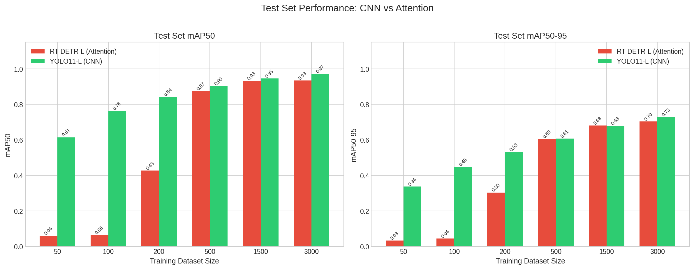
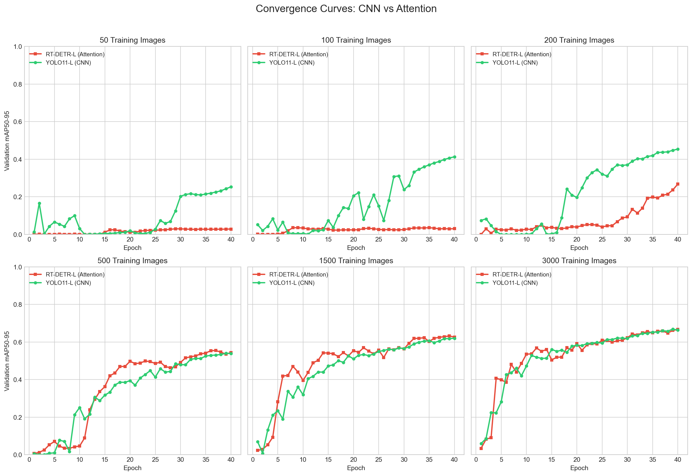

# Drone Detection: CNN vs Attention

**Deep Learning Course Project 0460217**
*Omri Smak & Noam Gati*

## Overview

Drones are increasingly common in both civilian and restricted airspaces. Detecting drones in images and video is important for security, privacy, and airspace safety applications.

We compare two different object detection architectures for drone detection:

- **YOLO11-L** - CNN-based
- **RT-DETR-L** - Transformer-based

Our hypothesis: YOLO's inductive biases should help it learn faster with less data, while RT-DETR's flexibility might require more examples to reach the same performance. We test this by training both models on increasing dataset sizes (50, 100, 200, 500, 1500, 3000 images) and comparing their convergence speed and final accuracy.

## Results


*Test mAP across different training set sizes*


*Validation mAP over training epochs*

## Installation

```bash
pip install -r requirements.txt
```

## Dataset Setup

1. Download from Roboflow: https://universe.roboflow.com/uavs-7l7kv/uavs-vqpqt
2. Export as "YOLOv11" format
3. Extract to `data/dataset/` with this structure:

```
data/dataset/
├── train/
│   ├── images/
│   └── labels/
├── valid/
│   ├── images/
│   └── labels/
└── test/
    ├── images/
    └── labels/
```

## Running the Notebooks

### 1. Training

```bash
jupyter notebook notebooks/01_train_comparison.ipynb
```

**What it does:**
- Trains YOLO11-L and RT-DETR-L on 6 dataset sizes (50, 100, 200, 500, 1500, 3000)
- Saves model weights and metrics to `artifacts/{model}_{size}/`

If you want live dashboards, set `USE_WANDB = True` in the notebook.

### 2. Analysis

```bash
jupyter notebook notebooks/02_analyze_results.ipynb
```

**What it does:**
- Loads trained models from `artifacts/`
- Evaluates each on the test set
- Generates comparison plots (convergence curves, data efficiency)
- Saves results to `results/` folder

## Project Structure

```
drone-detection/
├── notebooks/
│   ├── 01_train_comparison.ipynb
│   └── 02_analyze_results.ipynb
├── artifacts/              # training outputs 
├── example_results/        # pre-generated plots for reference
├── results/                # your analysis outputs 
├── data/dataset/           # put the dataset here
└── requirements.txt
```

## Training Configuration

- 40 epochs, AdamW optimizer, lr=0.001, batch size 16, 640px images
- Checkpoints saved every 10 epochs
- Both models start from COCO-pretrained weights